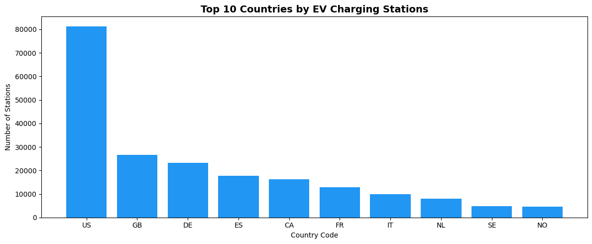
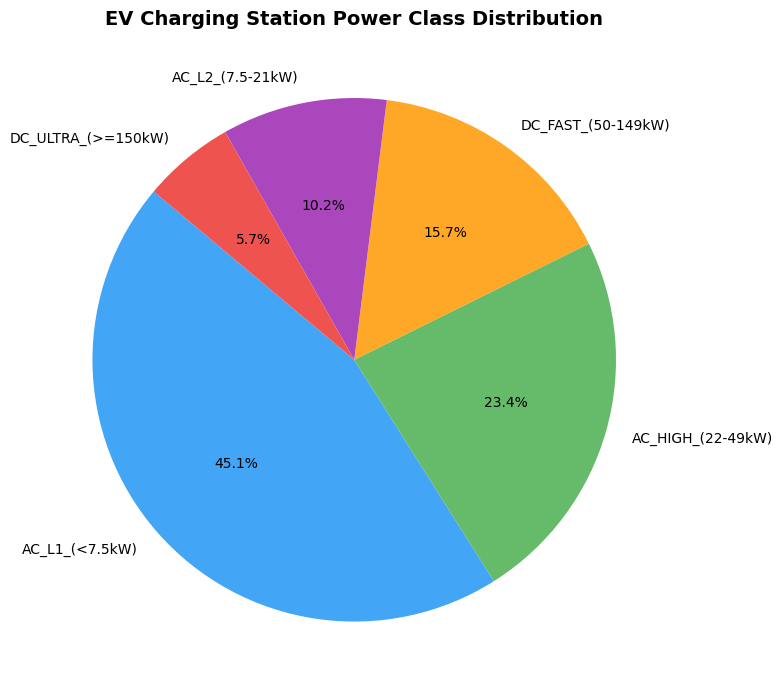
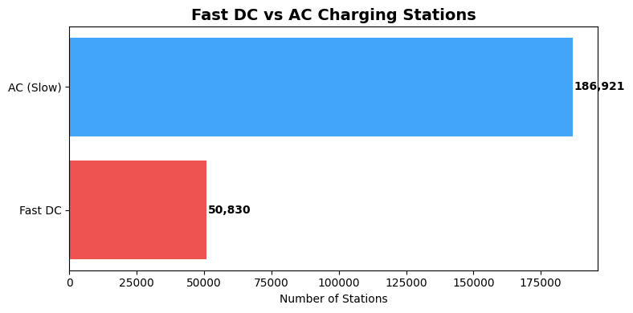
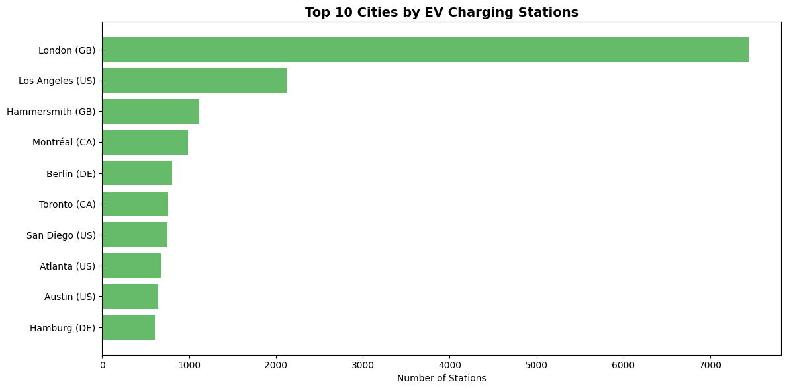

# EV Charging Infrastructure Analytics
> Large-scale EV charging station analysis using PySpark, Delta Lake, and Databricks

## Project Overview
An end-to-end data engineering pipeline that ingests, cleans, and analyses a dataset of **237,751 EV charging stations** across the globe. Built to demonstrate production-grade ETL practices using modern data stack tools.

## Architecture

Raw CSV (242K records)
↓
PySpark Cleaning & Transformation
↓
Delta Lake (Versioned Storage)
↓
SQL Analytics + Matplotlib Visualizations

## Tech Stack
| Tool | Purpose |
|------|---------|
| PySpark | Data ingestion, cleaning, transformations |
| Delta Lake | Versioned, reliable data storage |
| Databricks | Unified compute and notebook environment |
| SQL | Analytical queries |
| Matplotlib | Visualizations |
| Git / GitHub | Version control |

## Key Findings
- 🇺🇸 **USA leads** with 81,361 stations — 3x more than the UK (26,627)
- 🇬🇧 **London** is the most EV-ready city globally with 7,441 stations
- ⚡ **78% of stations are AC (slow charging)** — fast DC infrastructure still maturing
- 🇮🇳 **India has the highest average power per station** (898 kW) — indicating an ultra-fast DC only rollout strategy
- Fast DC stations have on average **11x more power** than AC stations (124 kW vs 11 kW)

## Notebooks
| Notebook | Description |
|----------|-------------|
| `01_ingestion` | Load raw CSV, clean and cast data types, save to Delta Lake |
| `02_analysis` | SQL-based analytical queries across countries, cities, power classes |
| `03_visualizations` | Matplotlib charts for key insights |

## Charts
### Top 10 Countries by Station Count

### Power Class Distribution

### Fast DC vs AC Stations

### Top 10 Cities

## Dataset
- **Source:** Open Charge Map (public EV infrastructure dataset)
- **Records:** 237,751 stations after cleaning
- **Coverage:** Global, 100+ countries

## How to Run
1. Upload `ev_charging_data.csv` to your Databricks Volume
2. Run `01_ingestion.ipynb` to clean and load data into Delta Lake
3. Run `02_analysis.ipynb` for analytical queries
4. Run `03_visualizations.ipynb` to generate charts

## Author
**Sai Teja Eleti** — Data Engineer
